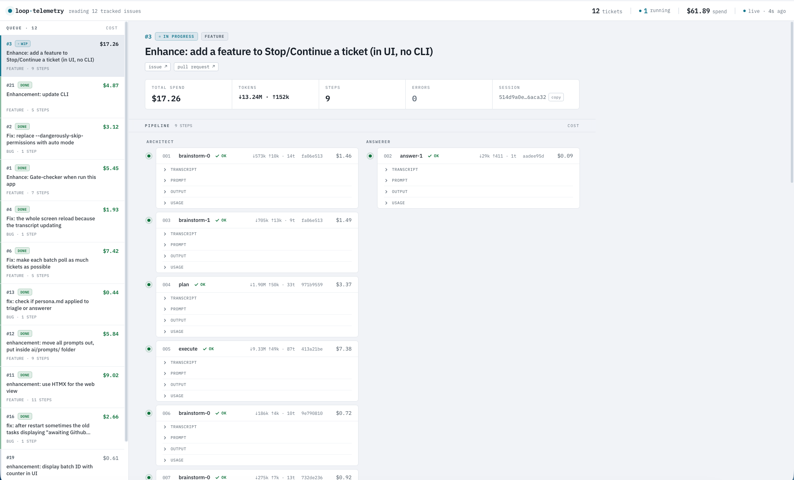
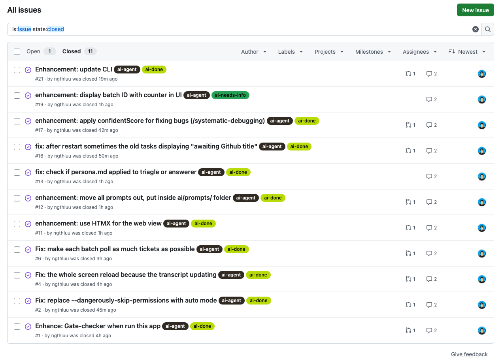

# loope — event-driven loop

[](https://github.com/ngthluu/loope/actions/workflows/ci.yml)
[](https://github.com/ngthluu/loope/actions/workflows/release.yml)
[](LICENSE)
[](go.mod)

`loope` is an event-driven loop that watches one GitHub repository for issues
labeled `ai-agent`, picks the best one, and drives it all the way to a pull
request using headless
[Claude Code](https://docs.anthropic.com/en/docs/claude-code) sessions running
inside git worktrees. Issue state lives entirely in GitHub labels, so the daemon
itself is stateless and safe to restart.

Label an issue `ai-agent` and each poll cycle loope triages the best candidate,
runs a bug- or feature-specific pipeline of Claude sessions in an isolated
worktree, and — if the work produced commits — pushes the branch and opens a PR.
A live web dashboard shows every issue it has touched. See
[How it works](docs/how-it-works.md) for the full lifecycle.

<p align="center">
  
  <br>
  <sub><em>The live dashboard — every tracked issue, its pipeline steps, and per-step cost, tokens, and Claude session id.</em></sub>
</p>

<p align="center">
  
  <br>
  <sub><em>Label an issue <code>ai-agent</code> and loope drives it to a PR — closing it <code>ai-done</code>, or parking it <code>ai-needs-info</code> when it needs clarification.</em></sub>
</p>

## Install

```sh
curl -fsSL https://raw.githubusercontent.com/ngthluu/loope/main/install.sh | sh
```

This downloads the prebuilt binary for your OS/arch from the
[latest release](https://github.com/ngthluu/loope/releases/latest), verifies its
checksum, and installs it to `/usr/local/bin`. Binaries are published for macOS
and Linux on `amd64` and `arm64`.

> loope is a wrapper around your local toolchain: it needs `git`, `gh`
> (authenticated), and `claude` on your `PATH` at run time. See
> [Installation](docs/installation.md) for prerequisites, the `--doctor`
> preflight, and building from source.

Then point it at a repo and run:

```bash
# grab loope.json.example from this repo (or the release archive), then:
cp loope.json.example loope.json   # edit repoPath / repoSlug / workDir
loope --config loope.json          # polls for labeled issues, serves the dashboard on http://localhost:8080
```

## Documentation

| Guide | What's inside |
|-------|---------------|
| [How it works](docs/how-it-works.md)     | Poll cycle, triage routes, label lifecycle, confidence gate |
| [Installation](docs/installation.md)     | Prerequisites, `--doctor`, label setup, building from source |
| [Configuration](docs/configuration.md)   | Every config field — models, retries, confidence gate, persona |
| [Dashboard](docs/dashboard.md)           | The live web dashboard and its embedded assets |
| [Operations](docs/operations.md)         | Always-on behavior, auto-resume, running as a launchd service |
| [Development](docs/development.md)        | Testing, prompts, logs, releasing, contributing |

## Contributing

Issues and pull requests are welcome. CI (`go build`, `go vet`, `go test ./...`)
must pass; please keep new behavior covered by tests that run without the network
or external CLIs. See [Development](docs/development.md).

## License

[MIT](LICENSE) © ngthluu
