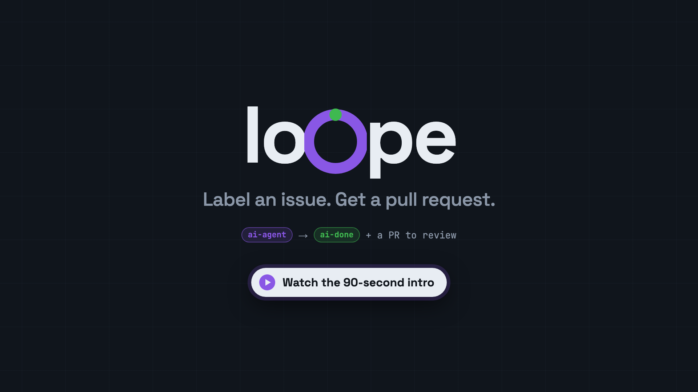

<p align="center">
  <a href="docs/images/loope-intro.mp4">
    
  </a>
</p>

<h1 align="center">loope</h1>

<p align="center"><strong>Label a GitHub issue. Get a pull request.</strong><br>
An always-on loop that turns your issues into reviewed PRs with Claude Code — with no infrastructure to run.</p>

<p align="center">
  <a href="https://github.com/ngthluu/loope/actions/workflows/ci.yml"></a>
  <a href="https://github.com/ngthluu/loope/actions/workflows/release.yml"></a>
  <a href="LICENSE"></a>
  <a href="go.work"></a>
</p>

## Why loope

- **You add one label.** `ai-agent` on the issue you already wrote. That's the whole workflow.
- **It asks before it guesses.** A vague issue gets you questions, not a wrong PR.
- **Design first — with your product owner in the room.** An architect agent debates a product-owner agent that decides the way you would, from a few rules you write once.
- **Ships like a teammate.** A PR that closes the issue, a hand-verification checklist, and a review pass before anything is called done.
- **Failures park. They never loop.** Rate limit, budget cap, crash — the issue is parked with the full error and nothing retries until you say so. It never burns tokens unattended.
- **One board. Many machines. Every account.** Run workers on as many machines and Claude Code logins as you have; route issues by label. The issue board is the only thing they share — no queue, no database, no coordinator.
- **See every step, and what it cost.** Tokens, cost and session per step; one fleet view of every worker and how much usage each account has left.

## Install

```sh
curl -fsSL https://raw.githubusercontent.com/ngthluu/loope/main/install.sh | sh
loope --config loope.json
```

One Go binary for macOS and Linux. Bring your own `git`, `gh` and `claude` — nothing else to run.
Start from [`worker/loope.json.example`](worker/loope.json.example); see [Installation](docs/installation.md).

## Learn more

| | |
|---|---|
| [How it works](docs/how-it-works.md) | The lifecycle, the label state machine, the confidence gate |
| [Installation](docs/installation.md) | Prerequisites, `--doctor`, labels, building from source |
| [Configuration](docs/configuration.md) | Models, retries, persona, per-worker labels, fleet telemetry |
| [Dashboard](docs/dashboard.md) · [Fleet telemetry](docs/telemetry.md) | What you see while it runs |
| [Operations](docs/operations.md) | Always-on behaviour, failure handling, running as a service |
| [Development](docs/development.md) · [Release notes](docs/release-notes/) | Contributing and what changed |

## License

[MIT](LICENSE) © ngthluu
