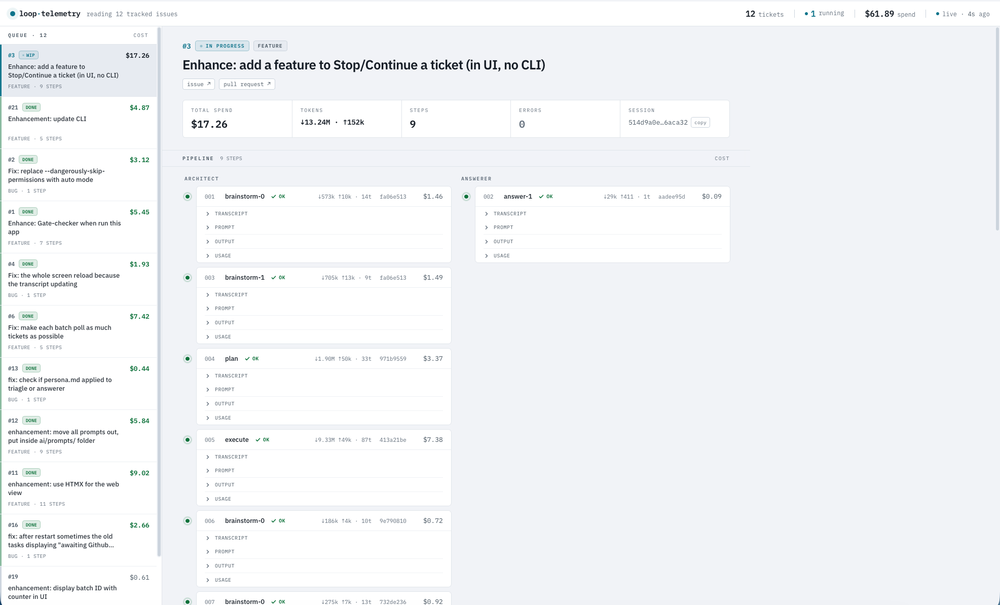
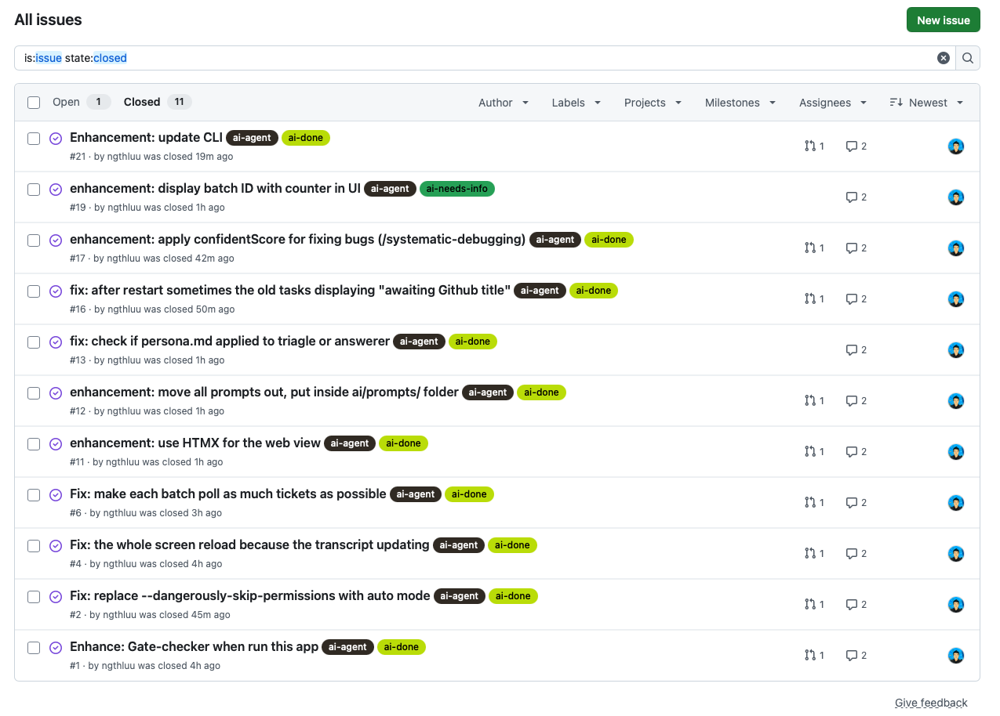

# loope — event-driven loop

[](https://github.com/ngthluu/loope/actions/workflows/ci.yml)
[](https://github.com/ngthluu/loope/actions/workflows/release.yml)
[](LICENSE)
[](go.work)

`loope` is an event-driven loop that watches one GitHub repository for issues
labeled `ai-agent` and drives each one all the way to a pull request using
headless [Claude Code](https://docs.anthropic.com/en/docs/claude-code) sessions
running inside git worktrees. Issue state lives entirely in GitHub labels, so
the daemon itself is stateless and safe to restart.

Label an issue `ai-agent` and, on the next poll cycle, loope claims it into a
free slot (up to `ticketsPerCycle` issues run concurrently) and runs a pipeline
of Claude sessions in an isolated worktree on branch `ai/issue-<N>`:

- **Entry** — one session investigates the repository and scores its
  confidence; below `confidenceThreshold` it parks the issue as
  `ai-needs-info` with a question instead of guessing. Otherwise it commits to
  an outcome that loope reads as structured output (enforced with the Claude
  CLI's `--json-schema`, not by grepping prose): `fix_committed` for a
  well-scoped defect fixed directly, `spec_ready` for anything that needs
  design first, or `already_done`.
- **Design first** — for `spec_ready`, the entry session brainstorms with a
  cheaper product-owner-proxy agent, then fresh sessions turn the committed
  spec into a plan and execute it; an `incomplete` execute report parks the
  issue rather than shipping a half-done branch.
- **UAT checklist** — a short read-only session posts a checklist on the
  issue from the diff or the spec.
- **Ship** — if the work produced commits, the branch is pushed and a PR
  opened (`Closes #N`). An optional post-ship **code review** loop runs
  `/code-review --fix` rounds against the shipped diff before the issue is
  closed `ai-done`.

Add `ai-resolve-merge` to an in-flight issue and loope merges the default
branch into its branch, resolves conflicts with one session, and pushes.
A live web dashboard shows every issue it has touched. See
[How it works](docs/how-it-works.md) for the full lifecycle and label state
machine.

<p align="center">
  <a href="docs/images/loope-intro.mp4">
    
  </a>
  <br>
  <sub><em>Label an issue, get a pull request — what makes loope different, in 90 seconds. (<a href="docs/images/loope-intro.mp4">MP4 version</a>)</em></sub>
</p>

<p align="center">
  
  <br>
  <sub><em>The live dashboard — every tracked issue, its pipeline steps, and per-step cost, tokens, and Claude session id.</em></sub>
</p>

<p align="center">
  
  <br>
  <sub><em>Label an issue <code>ai-agent</code> and loope drives it to a PR — closing it <code>ai-done</code>, or parking it <code>ai-needs-info</code> when it needs clarification.</em></sub>
</p>

## Install

```sh
curl -fsSL https://raw.githubusercontent.com/ngthluu/loope/main/install.sh | sh
```

This downloads the prebuilt binary for your OS/arch from the
[latest release](https://github.com/ngthluu/loope/releases/latest), verifies its
checksum, and installs it to `/usr/local/bin`. Binaries are published for macOS
and Linux on `amd64` and `arm64`.

> loope is a wrapper around your local toolchain: it needs `git`, `gh`
> (authenticated), and `claude` on your `PATH` at run time. See
> [Installation](docs/installation.md) for prerequisites, the `--doctor`
> preflight, and building from source.

Then point it at a repo and run:

```bash
loope --doctor                     # optional: check git / gh / claude / superpowers before writing a config
# grab worker/loope.json.example from this repo (or the release archive), then:
cp worker/loope.json.example loope.json   # edit repoPath / repoSlug / workDir
loope --config loope.json          # polls for labeled issues, serves the dashboard on http://localhost:8080
```

Every run starts with the same preflight; a healthy run prints nothing, a
failed check prints the report and exits.

## Documentation

| Guide | What's inside |
|-------|---------------|
| [How it works](docs/how-it-works.md)     | Poll cycle, entry routes, label lifecycle, confidence gate |
| [Installation](docs/installation.md)     | Prerequisites, `--doctor`, label setup, building from source |
| [Configuration](docs/configuration.md)   | Every config field — models, retries, confidence gate, persona |
| [Dashboard](docs/dashboard.md)           | The live web dashboard and its embedded assets |
| [Fleet telemetry](docs/telemetry.md)     | `loope-telemetry-server` (own binary + Dockerfile), worker opt-in, and Claude usage capture |
| [Operations](docs/operations.md)         | Always-on behavior, failure handling, running as a launchd service |
| [Development](docs/development.md)        | Testing, prompts, logs, releasing, contributing |
| [Release notes](docs/release-notes/)     | What changed in each tagged release |

## Contributing

Issues and pull requests are welcome. CI (`go build`, `go vet`, `go test ./...`)
must pass; please keep new behavior covered by tests that run without the network
or external CLIs. See [Development](docs/development.md).

## License

[MIT](LICENSE) © ngthluu
