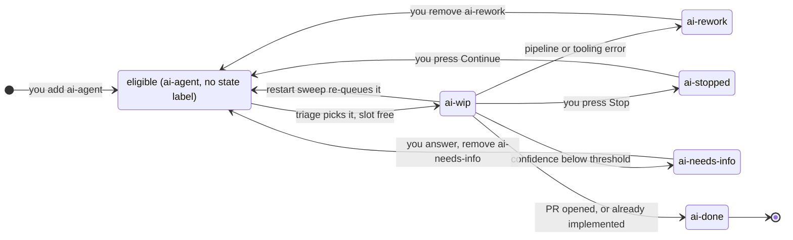

# How loope works

Each poll cycle runs four steps:

1. **List** open issues carrying the eligible label (default `ai-agent`) that
   don't yet have a state label.
2. **Triage** — a Claude agent picks the single best issue and classifies it:
   - **`bug`** — small, well-scoped defect → one systematic-debugging session.
     It investigates, scores how confidently the bug can be fixed as reported
     and, below `confidenceThreshold`, escalates to `ai-needs-info` instead of
     guessing (see [Confidence gate](configuration.md#confidence-gate));
     otherwise it reproduces with a failing test, fixes, and commits. A short
     read-only session then reads the issue and the resulting diff and posts a
     UAT checklist as an issue comment.
   - **`feature`** — anything needing design → three sessions. An architect
     brainstorm session scores confidence and, below `confidenceThreshold`,
     escalates to `ai-needs-info`; otherwise it brainstorms with a cheaper
     "product owner proxy" agent in a Q&A loop, then writes and commits the
     spec. A short read-only session then turns that spec into a UAT checklist
     posted as an issue comment. A **fresh** session turns the spec into a
     committed implementation plan, and a third session executes the plan.
   - **`done`** — the work is already fully implemented in the codebase → the
     loop comments, applies `ai-done`, and closes the issue without opening a PR.
3. **Work** happens on branch `ai/issue-<N>` in a dedicated git worktree under
   `workDir`, created from the remote default branch.
4. **Ship** — if the pipeline produced at least one commit, the branch is pushed
   and a PR is opened (`Closes #N`); the PR URL is commented on the issue.

## UAT checklist

Both routes publish a hand-verification checklist as a **new issue comment**,
leaving the issue's own body — the human's report — untouched. The comment
carries a `## 🤖 UAT checklist` heading preceded by an invisible
`<!-- loope:uat -->` marker. The marker is the idempotency key: an issue that
already carries it — in a comment, or in the body, where older versions
published — is never given a second checklist, so a re-queued run leaves the
first one in place.

The step is deliberately non-blocking. It runs in its own ephemeral session
(`models.uat`, no inheritance from `architect`) with `Write`, `Edit` and
`NotebookEdit` disabled, and it never overwrites the issue's recorded session. If anything
goes wrong — the issue fetch fails, the session errors or hits its cap, the
result carries no checklist, the comment is rejected — the step logs the issue
number and the reason and returns, and the pipeline carries on to plan/execute
or to shipping. The session's full output is kept as
`<seq>-uat.output.md` in the issue's log directory either way.

On the feature route it starts as soon as the spec is committed and then runs
**alongside** the plan session: the checklist describes the behavior the spec
promises, and nothing downstream reads it, so the plan never waits for it. The
pipeline joins the UAT session before it returns, so the session never outlives
the worktree it is reading. On the bug route it runs after the fix (nothing is
left to overlap it with), from the issue plus `git diff origin/<base>...HEAD`,
and only on the outcome where a fix was actually produced — an `ai-needs-info`
escalation or an already-done close publishes nothing.

## Concurrency and scheduling

A poll cycle does **not** wait for the pipelines it starts. It fills the free
`ticketsPerCycle` slots, returns, and polls again one interval later — so work
labelled while other pipelines are running is picked up as soon as a slot frees,
rather than at the end of a batch.

Every cycle draws from one queue — the eligible issues — so there is no priority
ordering to reason about. A re-queued issue (you removed `ai-rework`, you pressed
**Continue**, or the orphan sweep re-queued a crashed run) is just an eligible
issue again, competing for slots on equal terms and triaged like any other.

On shutdown (Ctrl-C / SIGTERM) the daemon stops polling and waits for in-flight
pipelines to finish, so the `workDir` lock is never released while a pipeline is
live. Signal a second time to quit immediately without draining.

## Status state machine

An issue's state **is** its label. There is no separate status store: the loop
reads state back off GitHub, so relabelling an issue by hand is the supported way
to move it between states. Label names are configurable — see
[`stateLabels`](configuration.md#statelabels); this page uses the defaults.

An issue is **eligible** when it carries the eligible label (default `ai-agent`)
and *no* state label. Adding any state label takes it out of the queue;
removing it puts it back.

### States

| Label           | Meaning                                                              |
|-----------------|----------------------------------------------------------------------|
| `ai-agent`      | You add this: the issue is eligible for the loop                     |
| `ai-wip`        | The loop is working on it                                            |
| `ai-done`       | PR created (or work already present); issue leaves the queue         |
| `ai-rework`     | Pipeline hit an error; progress preserved, waiting for you           |
| `ai-needs-info` | Confidence was below the threshold; awaiting author clarification    |
| `ai-stopped`    | You stopped the run from the dashboard; preserved, awaiting Continue |

### Transitions

"Preserved" means the worktree, branch, logs, and the Claude session id (saved in
`logs/issue-<N>/session`) are left on disk, so the next attempt continues rather
than starting over.

| From | To | Trigger | Who acts | Preserved |
|------|----|---------|----------|-----------|
| eligible | `ai-wip` | Triage picks the issue and a slot is free | daemon | — |
| `ai-wip` | `ai-done` | Pipeline produced commits; branch pushed and PR opened | daemon | no (worktree removed) |
| `ai-wip` | `ai-done` | Pipeline judged the work already implemented — issue is also **closed**, no PR | daemon | no (worktree removed) |
| `ai-wip` | `ai-needs-info` | Confidence score below `confidenceThreshold`; questions commented | daemon | no (worktree removed) |
| `ai-wip` | `ai-rework` | Any pipeline, tooling, or ship failure — including "no commits produced" and panics; full error commented | daemon | **yes** |
| `ai-wip` | `ai-stopped` | You press **Stop** on the dashboard | you | **yes** |
| `ai-wip` | eligible | Orphan sweep found the run abandoned by a crashed daemon; the label is stripped and the issue re-queued | daemon | **yes** — next run reuses them |
| `ai-rework` | eligible | You remove the `ai-rework` label | you | **yes** — next run reuses them |
| `ai-stopped` | eligible | You press **Continue** | you | **yes** — next run reuses them |
| `ai-needs-info` | eligible | You answer the questions and remove the label | you | no — re-runs from scratch |
| `ai-done` | — | Terminal | — | — |

### Who moves what

The daemon has exactly one automatic state transition it can make on an issue it
is not actively running: the orphan sweep, which strips `ai-wip` from a run its
own crash abandoned and puts the issue back in the eligible queue. It is safe
because the `workDir` lock proves no other process owns that label, and it is
never destructive — the worktree, branch, logs and session stay on disk.

Everything else waits for you:

- **`ai-rework` is terminal.** A park is never retried automatically — not a
  usage or rate limit, not a turn/budget ceiling, not a network blip, not a
  crash. Retrying failures meant one broken issue re-ran the whole pipeline every
  cycle and burned tokens unattended. The park comment carries the full error and
  the way forward: remove the `ai-rework` label, and the issue is eligible again.
- **`ai-stopped` and `ai-needs-info` are inert by construction.** Neither is
  `ai-wip`, so the sweep — the only scan that can move an issue — cannot see
  them. A stopped ticket stays put even across a daemon restart, until you press
  **Continue** (see [the dashboard docs](dashboard.md#stop-and-continue-a-ticket)).

### What a re-queued run reuses

Removing `ai-rework` (or pressing **Continue**, or letting the sweep re-queue a
crashed run) sends the issue back through the *normal* cycle: it is triaged and
the pipeline runs again — but in the **worktree that is already on disk**.
`Worktree.Create` reuses whatever it finds at `<workDir>/issue-<N>` instead of
recreating it, so the previous attempt's commits are the starting point, and the
already-implemented check can close out work that turned out to be finished. What
is *not* carried over is the Claude conversation: the new run starts a fresh
session. Progress survives as commits, not as context.

See [Operations](operations.md#always-on-operation) for how crashes and
transient failures play out in practice.
